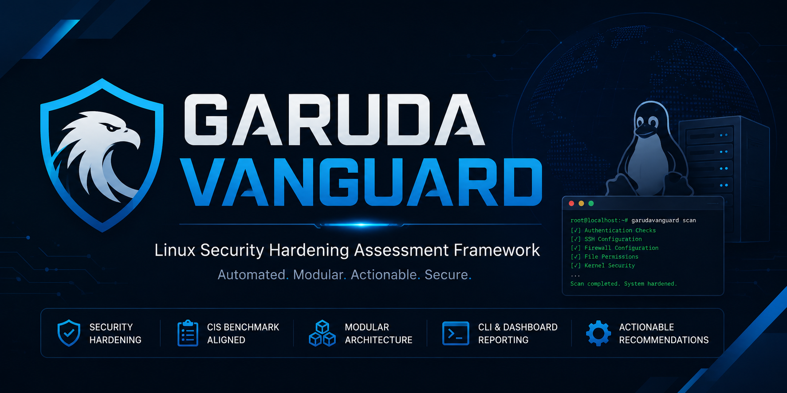

<p align="center">
  
</p>

GarudaVanguard is an open-source Linux Security Hardening Assessment Framework designed to help security engineers, system administrators, and blue teams assess Linux systems against selected CIS Linux Benchmark recommendations and security hardening best practices.

The framework performs automated security checks across multiple security domains through a modular architecture and provides actionable recommendations to improve the overall security posture of Linux environments.

---

## Features

- Authentication & User Security Assessment
- SSH Configuration Validation
- Firewall Configuration Checks
- Network Security Assessment
- Service Configuration Review
- File Permission Analysis
- SUID Enumeration
- World-Writable File Detection
- Kernel Security Checks
- Cron Job Inspection
- Temporary File Security Review
- Selected CIS Linux Benchmark Validation
- Modular Rule-Based Security Check Engine
- Actionable Security Recommendations

---

## Project Structure

```text
GarudaVanguard/
│
├── checks/          # Security check modules
├── config/          # Security rules and configuration
├── dashboard/       # Dashboard components (Work in Progress)
├── utils/           # Helper utilities
└── main.py          # Main application entry point
```

---

## Installation

```bash
git clone https://github.com/muhammad-khadafi-sec/GarudaVanguard.git

cd GarudaVanguard

pip install -r requirements.txt

python main.py
```

---

## Usage

Coming soon.

Comprehensive documentation and usage examples will be added in future releases.

---

## Roadmap

### Version 1.0

- [x] Modular Security Check Engine
- [x] Selected CIS Linux Benchmark Checks
- [x] Configuration-Based Rule Engine
- [x] Security Logging

### Version 1.1

- [ ] Interactive Web Dashboard
- [ ] HTML Report Generation
- [ ] JSON Report Export
- [ ] Scan Summary Dashboard

### Version 2.0

- [ ] Expanded CIS Linux Benchmark Coverage
- [ ] Automated Remediation
- [ ] Docker Support
- [ ] Compliance Reporting
- [ ] Plugin System

---

## Technology Stack

- Python 3
- Flask
- HTML / CSS
- JSON Configuration
- Linux

---

## License

This project is licensed under the MIT License.

---

## Disclaimer

GarudaVanguard is intended for defensive security assessment, Linux hardening validation, and educational purposes only.

Users are responsible for ensuring that the tool is used only on systems they own or are explicitly authorized to assess.